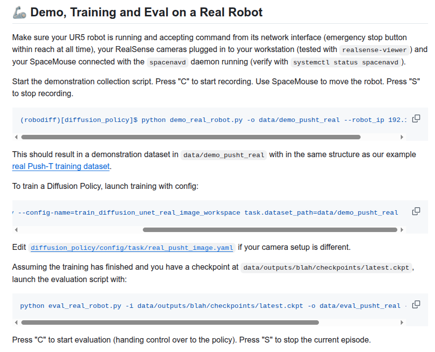

# Diffusion Policy
在ur5e真机上进行数采、训练和推理代码
## 环境搭建
参考DP原项目使用conda_environment_real.yaml进行conda环境创建，相关仿真的库在本项目中已经注释。
## 主要操作
demo_real_robot.py————进行数据采集（键盘控制）     
convert_abs_to_delta.py————将绝对位姿转化为增量
train.py————进行训练（config使用主目录下的image_pusht_diffusion_policy_cnn.yaml）
infer_real_robot_min.py————进行真机推理   
infer_uav.py————模型迁移推理   
相关完整命令参考原DP项目：

